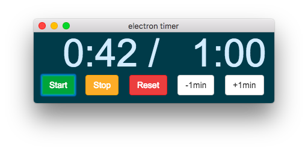
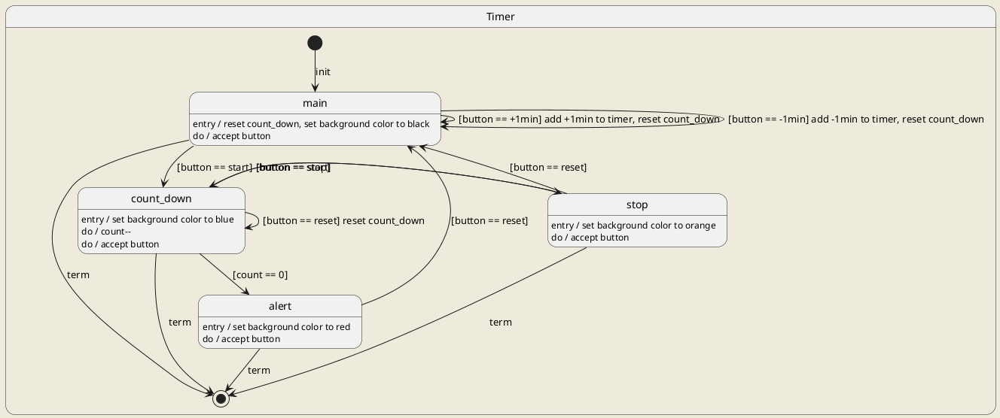

## electron-timer

* floating window



## Installation

```
git clone https://github.com/umaumax/electron-timer
cd electron-timer
npm install
```

## Execution

Pass the time in seconds in the command line.

```
electron .
electron . -n 60
electron . --debug
```



## ISSUE
* if press many start button, maybe multiple `setInterval()` will be called (accelerate timer spped).
* 60:00 is shown as 00:00
* 11:00 font is smaller than other time

## FYI
* [klugjo/electron\-timer\-app: Small Timer App]( https://github.com/klugjo/electron-timer-app )

* [electron\-builderでElectronアプリのビルド \- Qiita]( https://qiita.com/nanairo24/items/73356574b0dc65c0e617 )
* [electronでリリース用パッケージを作る \- PartyIX]( https://h3poteto.hatenablog.com/entry/2018/04/14/234353 )

## NOTE
### win icon size error
```
Unhandled rejection Error: image xxx/electron-timer/build/icons/icon.ico must be at least 256x256
```

### cross platform build
```
$ node build
electron-timer-0.0.1-mac.zip
electron-timer-0.0.1-win.zip
electron-timer-0.0.1.zip # linux
```

### how to release
```
git tag v0.0.1
git push origin v0.0.1
open https://github.com/umaumax/electron-timer/releases/new?tag=v0.0.1
```
